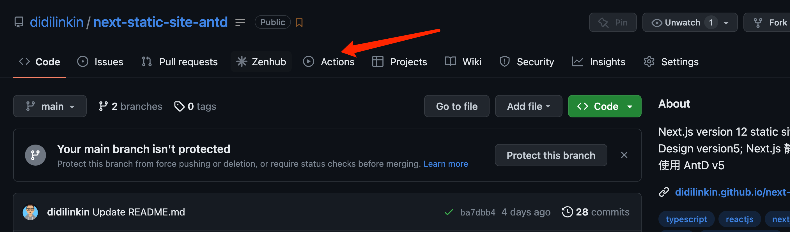
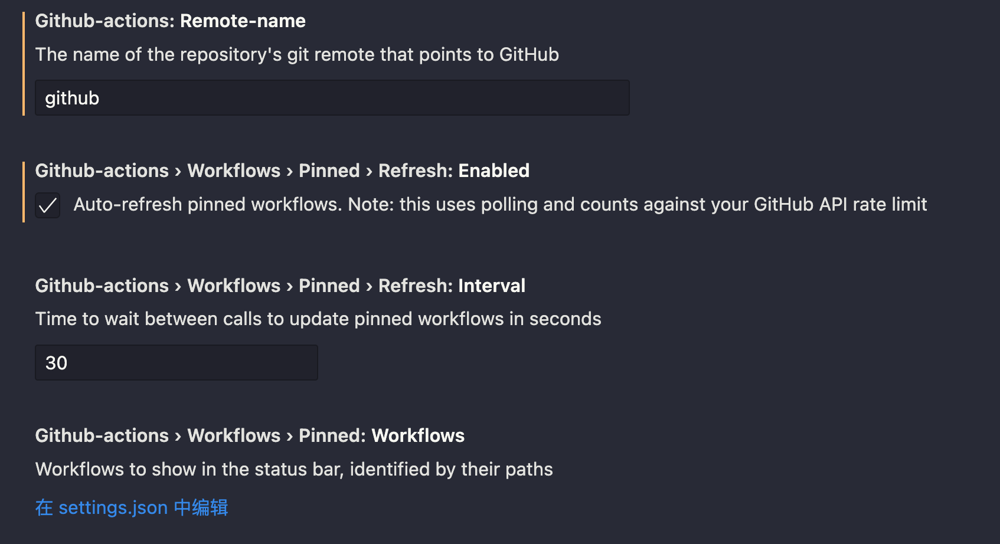
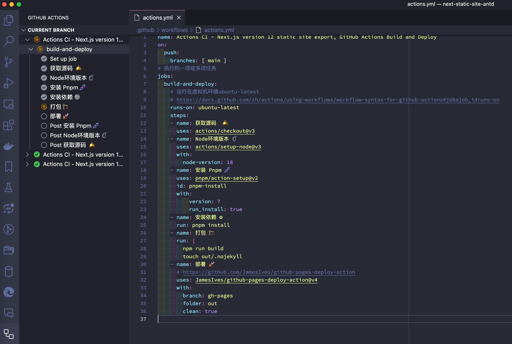
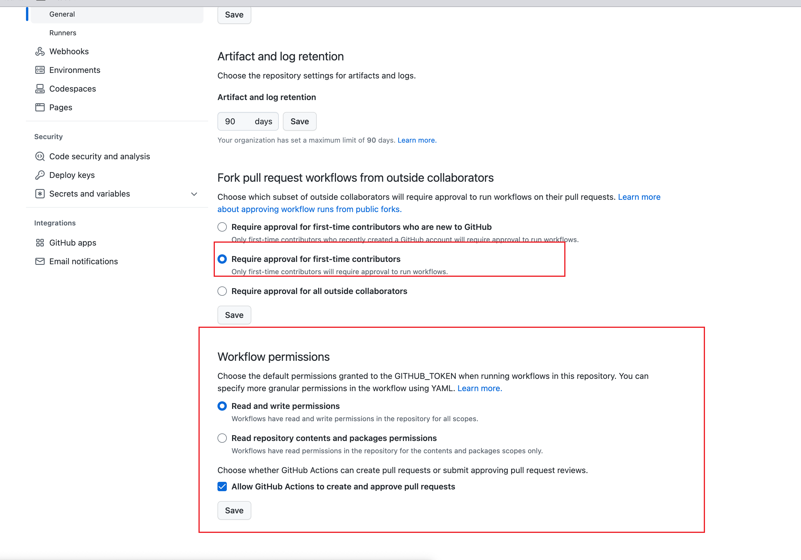

本文是一个简单教程, 将 `Next.js` 制作的静态网站, 通过 `GitHub Actions`构建打包，最后将其自动化部署到 `GitHub Pages`用于展示

<!--truncate-->


<br />

## 介绍:

* [GitHub Actions](https://github.com/features/actions) 是 GitHub的持续集成服务

* [Github Pages](https://docs.github.com/en/pages) 是 GitHub的静态站点托管服务

* [Next.js](https://nextjs.org/) 是 基于 React构建 服务端渲染 (SSR)应用的框架

### 在本教程中的步骤:

1. 将本地开发好的 `Next.js`项目上传到 GitHub, 启用 `GitHub Pages`服务

2. 配置 `GitHub Actions` workflow, 以便在 push时自动构建、导出和部署 静态网站到 `GitHub Pages`

3. 修改 `Next.js`的配置选项以适应 `GitHub Actions` URL结构

<br />


## 1. 配置 GitHub Pages

GitHub Pages 必须在每个 repo 的基础上打开, 打开它时，您可以选择要服务的分支

通常是将服务设置在 `.gh-pages`分支

1. 在浏览器中, 打开 GitHub 里的项目 repo

2. 在 `Settings > Pages > Source`中, 将 `Branch`分支设定在 `.gh-pages` 并点击 `Save`保存配置


<br />


## 2. 配置 GitHub Actions

GitHub Actions 是一种工具，可让你在 GitHub 仓库中执行不同的自动化操作

它允许你创建 自定义工作流，你可以使用这些工作流来自动化开发过程，例如 构建、 测试 和 部署代码



<br />

### 2.1 如何在仓库中设置 GitHub Actions

GitHub Actions 的配置文件叫做 `workflow` 文件，存放在代码仓库的 `.github/workflows`目录

`workflow` 文件采用 YAML 格式, 文件名可以任意取, 但是后缀名统一为`.yml`, 比如 `actions.yml`

一个库可以有多个 `workflow` 文件, GitHub 只要发现 `.github/workflows` 目录里面有 `*.yml`文件, 就会自动运行该文件

<br />

### 2.2 GitHub Actions 字段

* `name`: name 字段是 workflow 的名称。如果省略该字段，默认为当前 workflow 的文件名

* `on`: on 字段指定触发 workflow 的条件，通常是某些事件

* `on.<push|pull_request>.<tags|branches>`: 指定触发事件时，可以限定分支或标签

* `jobs.<job_id>.name`: workflow 文件的主体是jobs字段, 表示要执行的一项或多项任务

* `jobs.<job_id>.needs`: needs 字段指定当前任务的依赖关系, 即运行顺序

* `jobs.<job_id>.runs-on`: runs-on 字段指定运行所需要的虚拟机环境, 它是必填字段

* `jobs.<job_id>.steps`: steps 字段指定每个 Job 的运行步骤，可以包含一个或多个步骤, 每个步骤都可以指定以下三个字段

<br />

### 2.3 使用到的脚本

* [Setup Node.js environment: 配置 Node.js环境](https://github.com/marketplace/actions/setup-node-js-environment)
* [Setup pnpm: 配置 Pnpm安装依赖](https://github.com/marketplace/actions/setup-pnpm)
* [Deploy to GitHub Pages: 提供 部署能力](https://github.com/marketplace/actions/deploy-to-github-pages)
  * [Optional 参数说明](https://github.com/marketplace/actions/deploy-to-github-pages#optional-choices)

<br />

### 2.4 完整的配置

```yaml title=".github/workflows/actions.yml" showLineNumbers
name: Actions CI - Next.js version 12 static site export, GitHub Actions Build and Deploy
on:
  push:
    branches: [ main ]
# 执行的一项或多项任务
jobs:
  build-and-deploy:
    # 运行在虚拟机环境ubuntu-latest
    # https://docs.github.com/zh/actions/using-workflows/workflow-syntax-for-github-actions#jobsjob_idruns-on
    runs-on: ubuntu-latest
    steps:
    - name: 获取源码  🛎️
      uses: actions/checkout@v3
    - name: Node环境版本 🗜️
      uses: actions/setup-node@v3
      with:
        node-version: 18
    - name: 安装 Pnpm 🧬
      uses: pnpm/action-setup@v2
      id: pnpm-install
      with:
          version: 7
          run_install: true
    - name: 安装依赖 ⚙️
      run: pnpm install
    - name: 打包 🏗️
      run: |
        npm run build
        touch out/.nojekyll
    - name: 部署 🚀
      uses: JamesIves/github-pages-deploy-action@v4
      with:
        branch: gh-pages
        folder: out
        clean: true
```

<br />

### 2.5 VS Code 开发体验优化

通过安装 VS Code官方插件 [Github Actions](https://marketplace.visualstudio.com/items?itemName=github.vscode-github-actions)来更直观的 管理工作流、查看工作流 运行历史记录并帮助 创作工作流

插件配置 **注意事项**:

1. 设置 `VS Code`编辑器登录 `GitHub`账号, 并且绑定
2. 将 `remote`名称 设置为上传 GitHub的 `remote`名称, 默认值: `origin`



<br />

3. 勾选上图 `Auto-refresh` 自动刷新, 可以实时查看 `workflow`工作流状态



<br />


## 3. 配置 Next.js

### 3.1 配置路径

Next.js的 `next/image`、`next/link` 和 `next/router` 指定路径是相对于 `/`的

而 GitHub Pages 托管站点的URL为: `https://<你的github name>.github.io/<repo>`

> 如: `https://didilinkin.github.io/next-static-site-antd/`

所以 需要通过配置使 Next.js 得到 `/<repo>`

有两个相关的配置选项: [basePath](https://nextjs.org/docs/api-reference/next.config.js/basepath) 和 [assetPrefix](https://nextjs.org/docs/api-reference/next.config.js/cdn-support-with-asset-prefix)

将 `basePath` 设置为 `/<repo name>` 将生成 GitHub Pages 可访问链接

将 `assetPrefix` 设置为 `/<repo name>/` 将生成 GitHub Pages 可访问图像

<br />

```js title="next.config.js"
const repo = 'change-me-to-your-repo'
const assetPrefix = `/${repo}/`
const basePath = `/${repo}`

module.exports = {
  assetPrefix: assetPrefix,
  basePath: basePath,
}
```

<br />

让我们将这部分配置应用于 GitHub Pages

我们会通过使用 GitHub Actions 导出静态网站 拷贝到 GitHub Pages (详情如下)

利用 GitHub 自动为我们添加的 [环境变量](https://docs.github.com/en/actions/learn-github-actions/variables#default-environment-variables)

当 GitHub Actions 正在运行进程时, `GITHUB_ACTIONS` 为 `true`

`GITHUB_REPOSITORY` 为 `<owner>/<repo>`

```js title="next.config.js"
const isGithubActions = process.env.GITHUB_ACTIONS || false

let assetPrefix = ''
let basePath = '/'

if (isGithubActions) {
  // 去掉 `<owner>/`
  const repo = process.env.GITHUB_REPOSITORY.replace(/.*?\//, '')

  assetPrefix = `/${repo}/`
  basePath = `/${repo}`
}

module.exports = {
  assetPrefix,
  basePath,
}
```

<br />

### 3.2 以下为完整的配置

```js title="next.config.js"
/** @type {import('next').NextConfig} */
// 用于为静态资源（如图像、样式表、JavaScript 文件等）设置 URL 前缀
// 这在将应用部署到自定义域名或 CDN 上时特别有用，因为它允许您将静态资源存储在不同的位置
let assetPrefix = `/${repo}/`

// 用于为应用设置基础路径
// 这在将应用部署到子目录下时特别有用，因为它允许您指定应用所在的目录
let basePath = `/${repo}`

const isGithubActions = process.env.GITHUB_ACTIONS || false

if (isGithubActions) {
  const repo = process.env.GITHUB_REPOSITORY.replace(/.*?\//, '')
  assetPrefix = `/${repo}/`
  basePath = `/${repo}`
}

const nextConfig = {
  assetPrefix,
  basePath,
  reactStrictMode: true,
  images: {
    unoptimized: true,
  },
}

module.exports = nextConfig
```
<br />


## 示例代码

* [GitHub Repository](https://github.com/didilinkin/next-static-site-antd)

* [GitHub Pages 预览页面](https://didilinkin.github.io/next-static-site-antd/)


## 常见问题

* `Error: The deploy step encountered an error: The process '/usr/bin/git' failed with exit code "128"  ❌ Notice: Deployment failed! ❌`

  * [解决方案: 修改 `workflow permissions`](https://github.com/ad-m/github-push-action/issues/96#issuecomment-1396347833)

  * [解决方案: 修改 `workflow permissions`权限](https://github.com/actions/checkout/issues/417#issuecomment-1427951779)

  
<br />


## 参考链接

* [(主要借鉴) 阮一峰 - GitHub Actions 入门教程](https://www.ruanyifeng.com/blog/2019/09/getting-started-with-github-actions.html)
* [(主要借鉴) Using GitHub Pages to Build, Deploy, and Host Next.js](https://www.viget.com/articles/host-build-and-deploy-next-js-projects-on-github-pages/)
* [Using Composite GitHub Actions to make your Workflows smaller and more reusable](https://wallis.dev/blog/composite-github-actions)
* [GitHub Actions - Announcing the GitHub Actions extension for VS Code](https://github.blog/2023-03-28-announcing-the-github-actions-extension-for-vs-code/)
* [Deploying to Github Pages? Don't Forget to Fix Your Links](https://maximorlov.com/deploying-to-github-pages-dont-forget-to-fix-your-links/)
* [Automating build/deploy CI/CD with GitHub Actions](https://www.viget.com/articles/automating-build-deploy-ci-cd-with-github-actions/)
* [如何使用 GitHub Actions 实现开源项目的自动化](https://www.freecodecamp.org/chinese/news/automate-open-source-projects-with-github-actions/)
