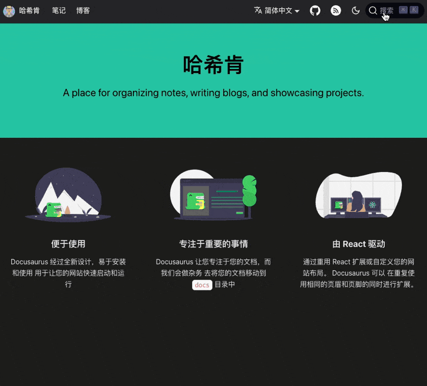
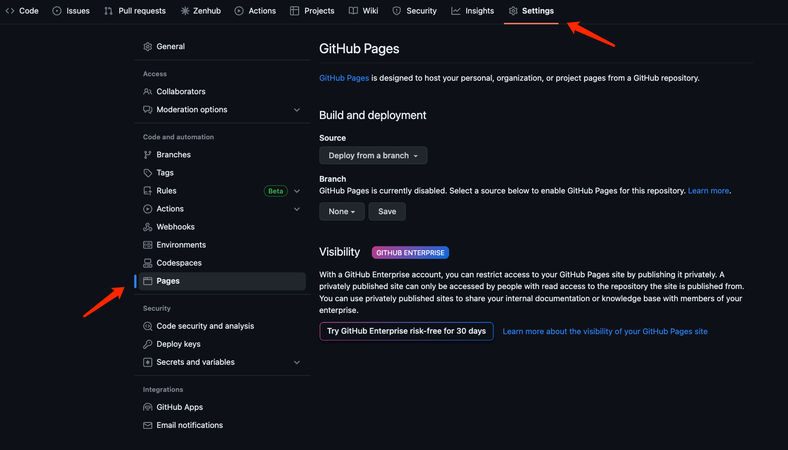
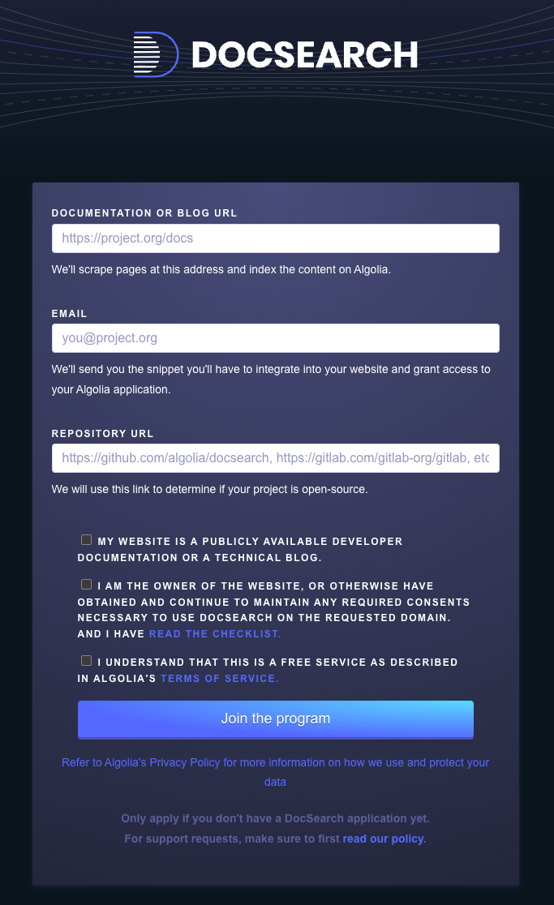
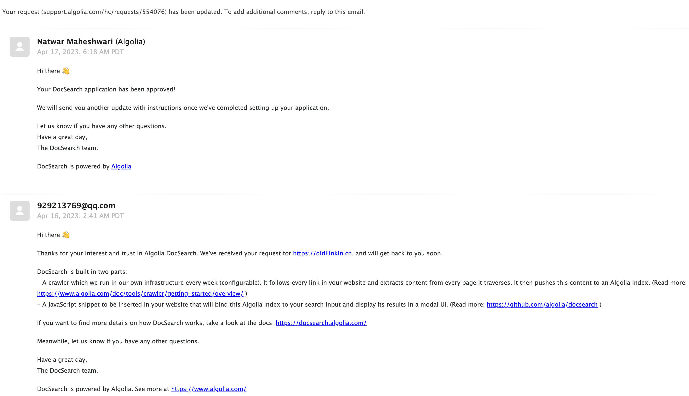
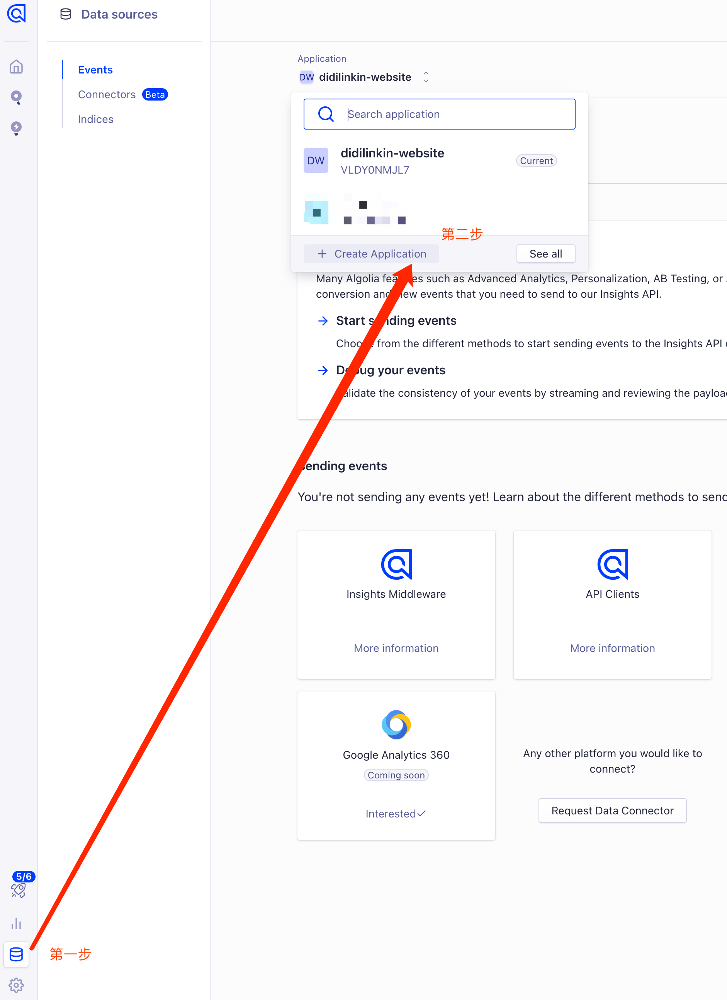
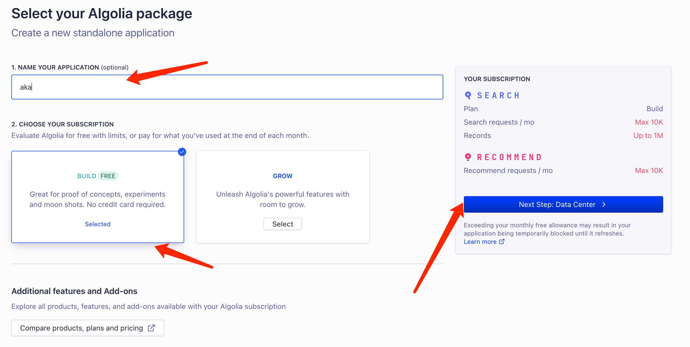
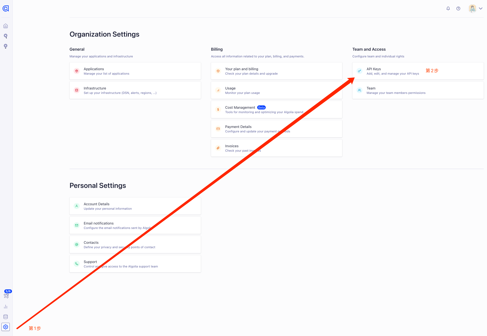
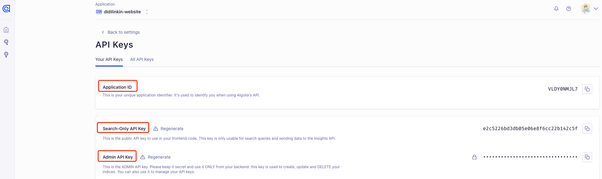
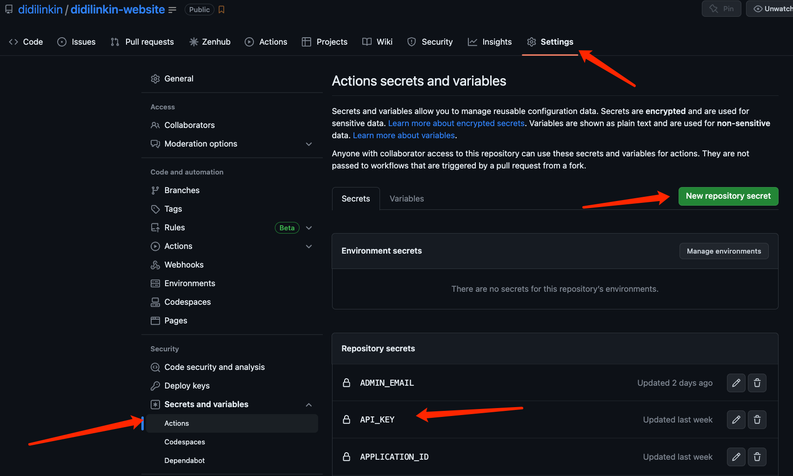
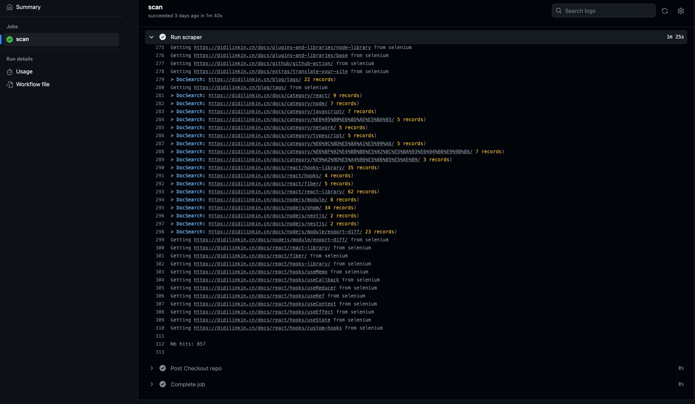

<br />


> 前言: Algolia 是什么？

Algolia 是一个搜索、推荐服务平台，可以通过简单的配置来为站点添加全文检索功能

基本原理：

通过爬虫对目标网站的内容创建 Records (记录), 在用户搜索时调用接口返回相关内容

<br />

<!--truncate-->

<br />



<br />

## 一. 需求描述

  为网站添加 实时搜索, 采用 Docusaurus2 官方支持的 [Algolia DocSearch](https://docsearch.algolia.com/)

  *Docsearch* 每周一次爬取网站 (可在网页界面上配置具体时间), 并将所有内容汇总到一个 *Algolia* 索引中

  随后，前端页面会调用 *Algolia API* 来直接查询这些内容

  > [Docusaurus 搜索功能文档](https://docusaurus.io/zh-CN/docs/search#using-algolia-docsearch)

<br />
<br />

## 二. 准备工作

### 1. Docsearch 官网申请

**前置条件**:
  * 准备项目域名地址 - 本案例: [https://didilinkin.cn/](https://didilinkin.cn/)

    :::note
    > 如没有 服务器和域名 也可用 *GitHub Pages*
    
    :::

  * 项目的开源地址 - 本案例: [https://github.com/didilinkin/didilinkin-website](https://github.com/didilinkin/didilinkin-website)

<br />

前置条件准备完成后, 就可到 [Docsearch](https://docsearch.algolia.com/apply/) 注册



<br />

提交后大约 2天内会收到 反馈邮件, 通知注册成功



<br />
<br />

### 2. 获取 *Application ID* & *API Keys*

前往 [Algolia 官网](https://www.algolia.com/), 登录账户 创建 *Application*



<br />

设置 *Application* 名称, 选择免费计划



最后选择响应速度快的服务后, 创建成功✅

<br />
<br />

控制台打开 设置页面，点击 *API keys*



找到 接下来本地配置需要的数据



<br />
<br />

## 三. 本地 Algolia Docsearch配置

* *.env* (键值不带双引号)

  ```bash
  APPLICATION_ID=Application ID
  API_KEY=Admin API Key # 务必确认, 这是坑点 不要用 'Write API Key' 或者 'Search API Key'
  ```

<br />

* *docusaurus.config.js*

  ```js
  module.exports = {
    // ...
    presets: [[
      // ...
      "classic",
      /** @type {import('@docusaurus/preset-classic').Options} */
      ({
        // 这个插件会为你的站点创建一个站点地图
        // 以便搜索引擎的爬虫能够更准确地爬取你的网站
        sitemap: {
          changefreq: "weekly",
          priority: 0.5,
          ignorePatterns: ["/tags/**"],
          filename: "sitemap.xml",
        },
      })
    ]],
    // ...
    themeConfig: {
      // ...
      algolia: {
        appId: 'YOUR_APP_ID', // Application ID
        //  公开 API密钥：提交它没有危险
        apiKey: 'YOUR_SEARCH_API_KEY', //  Search-Only API Key
        indexName: 'YOUR_INDEX_NAME'
      },
    }
  }
  ```
  * [Algolia DocSearch 插件文档](https://docusaurus.io/zh-CN/docs/search#using-algolia-docsearch)

  * [sitemap 插件文档](https://docusaurus.io/zh-CN/docs/api/plugins/@docusaurus/plugin-sitemap)

<br />

* *docsearch-config.json* (爬虫配置文件)

  > 需修改3处:
  >
  > * *index_name*
  >
  > * *start_urls*
  >
  > * *sitemap_urls*

  ```json
  {
    "index_name": "didilinkin-website",
    "start_urls": [
      "https://didilinkin.cn/"
    ],
    "sitemap_urls": [
      "https://didilinkin.cn/sitemap.xml"
    ],
    "sitemap_alternate_links": true,
    "stop_urls": [
      "/tests"
    ],
    "selectors": {
      "lvl0": {
        "selector": "(//ul[contains(@class,'menu__list')]//a[contains(@class, 'menu__link menu__link--sublist menu__link--active')]/text() | //nav[contains(@class, 'navbar')]//a[contains(@class, 'navbar__link--active')]/text())[last()]",
        "type": "xpath",
        "global": true,
        "default_value": "Documentation"
      },
      "lvl1": "header h1",
      "lvl2": "article h2",
      "lvl3": "article h3",
      "lvl4": "article h4",
      "lvl5": "article h5, article td:first-child",
      "lvl6": "article h6",
      "text": "article p, article li, article td:last-child"
    },
    "strip_chars": " .,;:#",
    "custom_settings": {
      "separatorsToIndex": "_",
      "attributesForFaceting": [
        "language",
        "version",
        "type",
        "docusaurus_tag"
      ],
      "attributesToRetrieve": [
        "hierarchy",
        "content",
        "anchor",
        "url",
        "url_without_anchor",
        "type"
      ]
    },
    "js_render": true,
    "conversation_id": [
      "833762294"
    ],
    "nb_hits": 46250
  }
  ```

  * [Algolia 官方用例](https://github.com/algolia/docsearch-configs/blob/master/configs/docusaurus-2.json)

<br />
<br />

## 四. 执行爬虫程序 - docsearch-scraper

> 以下两种 爬虫方式任选其一即可 (推荐使用 *GitHub Actions*)

<br />

### 1. 本地 执行爬虫

前置条件:
  * Docker
  * jq - 轻量级命令行 JSON 处理器

    > [使用 brew 安装最新版的 jq](https://github.com/stedolan/jq/wiki/Installation#zero-install)

  <br />

  jq安装完成后, 在命令行执行 爬虫脚本

  ```bash
  docker run -it --env-file=.env -e "CONFIG=$(cat docsearch-config.json | jq -r tostring)" algolia/docsearch-scraper
  ```

  等待 容器运行完成, 如下即可

  ```bash
  ...
  Getting https://didilinkin.cn/docs/react/hooks/custom-hooks from selenium
  Getting https://didilinkin.cn/docs/react/hooks/useMemo from selenium
  Getting https://didilinkin.cn/docs/react/hooks/useCallback from selenium
  Getting https://didilinkin.cn/docs/javascript/versions/es-2016 from selenium
  Getting https://didilinkin.cn/docs/javascript/versions/es-2015 from selenium
  > DocSearch: https://didilinkin.cn/docs/plugins-and-libraries/big-screen/ 17 records)
  > DocSearch: https://didilinkin.cn/docs/server/nginx/nginx-forward-proxy-vs-reverse-proxy/ 8 records)
  > DocSearch: https://didilinkin.cn/docs/category/caddy/ 3 records)
  > DocSearch: https://didilinkin.cn/docs/category/nginx/ 5 records)

  Nb hits: 1369
  ```

<br />

### 2. GitHub Actions 执行爬虫

在 `.github/workflows/` 文件夹下 创建 *docsearch-scraper.yml*, 用来定义 GitHub Actions 工作流

```yaml title="docsearch-scraper.yml"
name: 索引爬虫 docsearch-scraper

on:
  push:
    branches: [master]
  pull_request:
    branches: [master]

jobs:
  scan:
    runs-on: ubuntu-latest

    steps:
      - name: Sleep for 10 seconds
        run: sleep 10s
        shell: bash

      - name: Checkout repo
        uses: actions/checkout@v3

      - name: Run scraper
        env:
          APPLICATION_ID: ${{ secrets.APPLICATION_ID }}
          API_KEY: ${{ secrets.API_KEY }}
        run: |
          CONFIG="$(cat docsearch-config.json)"
          docker run -i --rm \
                  -e APPLICATION_ID=$APPLICATION_ID \
                  -e API_KEY=$API_KEY \
                  -e CONFIG="${CONFIG}" \
                  algolia/docsearch-scraper
```

  <br />

  然后在 GitHub 的 Secrets 创建

  * *APPLICATION_ID*

  * *API_KEY* — Admin API Key

  

  当使用 Git 推送项目到 GitHub时, *Actions*就会自动执行 爬虫任务

  

<br />
<br />


## 坑点

  * ### 官网邮件通知 创建好的项目 是没有 管理员权限的

  > 需要在个人主页, 重新创建项目, 注意起名字 不要冲突

<br />

  * ### index_name 需要三处对齐

    * docsearch-config.json - `index_name`
    * docusaurus.config.js - `indexName`
    * Algolia 官网 的项目名称 - `Application`

    如: *didilinkin-website*


<br />
<br />


## 示例代码

* [GitHub Repository](https://github.com/didilinkin/didilinkin-website)

* [实际效果 - 点击右上角 "搜索"](https://didilinkin.cn/)


<br />
<br />


## 常见问题

* *algoliasearch.exceptions.RequestException: Method not allowed with this API key*

  :::tip

  这个错误通常表示您在使用 Algolia Search API 时使用了无效的 API密钥或 API密钥权限不允许使用该请求方法

  :::

  * ### 分析
    使用的 key不对 - 当前使用的也许是 `Search-Only API Key`

  * ### 解决方法
    改为使用 `Admin API Key`

<br />

* *Error: Process completed with exit code 3.*

  :::tip

  由于尝试使用 Algolia Search API更新对象时所使用的 API密钥缺少必要的权限

  确认您正在使用具有正确权限的Algolia Search API密钥来更新对象

  :::

  * ### 分析
    使用的 key权限不对 - 当前使用的也许是  `Write API Key`

  * ### 解决方法
    改为使用 `Admin API Key`

<br />

* 本地执行 爬虫脚本, 报错: *Error: Cannot find module 'winston'*
  > 使用 yarn 重新安装 *winston*

  ```bash
  yarn global remove winston

  yarn global add winston
  ```

<br />

* 本地执行 爬虫脚本, 报错: *Error: { cli } was removed in winston@3.0.0.*

  ```bash
  # 查看本地的 全局依赖是否存在 jq (yarn)
  yarn global list --depth=0

  # 删除 jq依赖
  yarn global remove jq
  ```

<br />

* 本地执行 爬虫脚本, 报错: *zsh: command not found: jq*

  > 确保本地 *npm*, *yarn*, *pnpm* 的全局依赖中没有 *jq*, 使用 *brew*安装

  ```bash
  # 安装最新版 jq
  brew install --HEAD jq

  # 链接 最新版 jq
  brew link jq
  ```

<br />
<br />

## 参考链接
* [官网文档 - Run your own](https://docsearch.algolia.com/docs/legacy/run-your-own/#running-the-crawler-from-the-code-base)
* [使用 Docusaurus 搭建优秀个人wiki](https://blog.7wate.com/?p=75)
* [Docusaurus搭建个人博客](https://blog.csdn.net/kuizuo12/article/details/122642446)
* [jq - Installation](https://github.com/stedolan/jq/wiki/Installation#zero-install)

<br />
<br />
