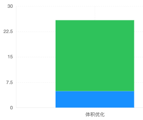
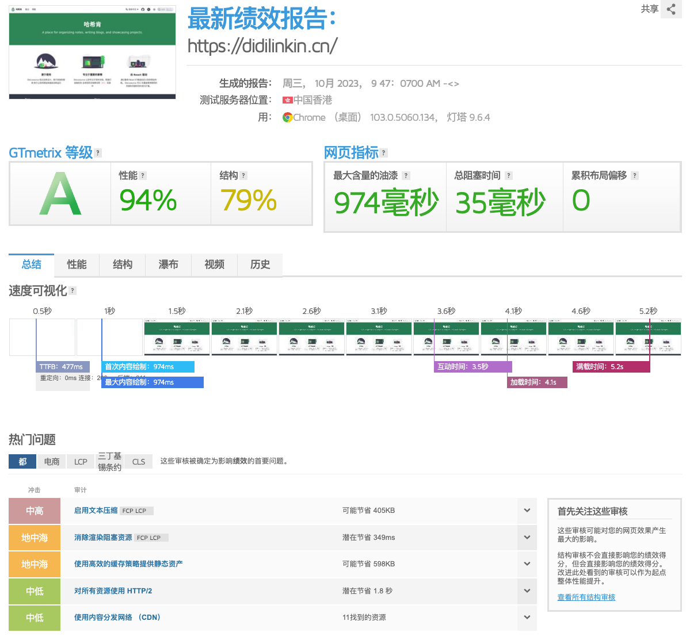

本篇文章记录 通过多种优化手段 提高本网站的性能表现, 加快访问速度

经过优化后的网站加载速度获得显著提升

<!--truncate-->

<br />

## 未优化时的加载状态


<br />
<br />

## 1. 优化 CDN

### CDN资源的选择

* [jsdelivr](https://www.jsdelivr.com/)
> 可用资源非常齐全, 加载速度快, 服务器在国外

* [字节跳动 静态资源公共库](https://cdn.bytedance.com/)
> 加载速度较快, 但需要的库版本滞后

* [七牛云的一个开源 CDN库](http://staticfile.org/)
> 提供的版本都较新, 加载速度最快

<br />

| *uikit.min.css* | 体积(kb) | 加载时间(ms) |
| :-----| :---- | ----: |
| 默认方式 | 297  | 5580 |
| Staticfile CDN | 30 | 55 |


<br />

| *sweetalert2.min.css* | 体积(kb) | 加载时间(ms) |
| :-----| :---- | ----: |
| 默认方式 | 21  | 114 |
| Staticfile CDN | 4.9 | 41 |



<br />

| *sweetalert2.min.js* | 体积(kb) | 加载时间(ms) |
| :-----| :---- | ----: |
| 默认方式 | 43.6  | 1080 |
| Staticfile CDN | 14.9 | 63 |


<br />
<br />

### 博客切换 CDN的性能优化


:::tip

加载时间 从 15.74秒 优化到 5.04

提升 68%


:::

<br />
<br />

## 2. 消除渲染阻塞资源

### [Docusaurus script脚本设置 defer文档](https://docusaurus.io/zh-CN/docs/api/docusaurus-config#scripts)

```js title="docusaurus.config.js"
module.exports = {
  scripts: [
    {
      src: "https://cdn.staticfile.org/sweetalert2/11.7.5/sweetalert2.min.js",
      async: true,
    },
  ],
};
```

<br />
<br />

## 3. 图片资源优化

### [图片优化工具-Google Squoosh](https://squoosh.app/)


<br />
<br />

## 测试其网页性能的工具

[Gtmetrix](https://gtmetrix.com/)



<br />
<br />

## 参考链接

* [前端CDN资源库](https://blog.csdn.net/qq_38652871/article/details/88060115)
