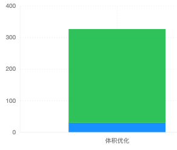

本篇文章记录 通过多种优化手段 提高本网站的性能表现, 加快访问速度

经过优化后的网站加载速度获得显著提升

<!--truncate-->

<br />

## 未优化时的加载状态


<br />
<br />

## 1. 优化 CDN

### CDN资源的选择

* [jsdelivr](https://www.jsdelivr.com/) - 可用资源非常齐全, 加载速度快, 服务器在国外

* [字节跳动 静态资源公共库](https://cdn.bytedance.com/) - 加载速度较快, 但需要的库版本滞后

* [七牛云 Staticfile CDN库](http://staticfile.org/) - 提供的版本都较新, 加载速度最快

<br />

| *uikit.min.css* | 体积(kb) | 加载时间(ms) |
| :-----| :---- | ----: |
| 默认方式 | 297  | 5580 |
| Staticfile CDN | 30 | 55 |



<br />

| *sweetalert2.min.css* | 体积(kb) | 加载时间(ms) |
| :-----| :---- | ----: |
| 默认方式 | 21  | 114 |
| Staticfile CDN | 4.9 | 41 |


<br />

| *sweetalert2.min.js* | 体积(kb) | 加载时间(ms) |
| :-----| :---- | ----: |
| 默认方式 | 43.6  | 1080 |
| Staticfile CDN | 14.9 | 63 |


<br />
<br />

### 博客切换 CDN的性能优化


:::tip

加载时间 从 15.74秒 优化到 5.04

提升 68%


:::

<br />
<br />

## 2. 消除渲染阻塞资源

### [Docusaurus script脚本设置 defer文档](https://docusaurus.io/zh-CN/docs/api/docusaurus-config#scripts)

```js title="docusaurus.config.js"
module.exports = {
  scripts: [
    {
      src: "https://cdn.staticfile.org/sweetalert2/11.7.5/sweetalert2.min.js",
      async: true,
    },
  ],
};
```

查看首页 HTML

```HTML
<script
  src="https://cdn.staticfile.org/sweetalert2/11.7.5/sweetalert2.min.js"
  defer="defer"
></script>
```

<br />
<br />

## 3. 图片资源优化

### [图片优化工具-Google Squoosh](https://squoosh.app/)


<br />
<br />

## 4. 开启 Brotli 压缩

### Brotli 介绍

Brotli 是一种新的数据压缩算法，由 Google 开发，旨在提供更高的压缩比率和更快的解压速度

Brotli 算法使用了现代的压缩技术，包括预测编码、上下文建模和 Huffman 编码等，可以达到比传统压缩算法 (如 gzip) 更高的压缩比率和更快的解压速度

Brotli 算法在 HTTP 协议中被广泛应用，可以用于压缩 HTTP 响应内容, 从而减少网络传输的数据量, 提高网络传输的效率和性能

Brotli 算法相对于传统的 gzip 压缩算法，可以获得更高的压缩比率，通常可以达到 20% 到 30% 的数据压缩率提升

<br />
<br />


我们可以看到 Brotli 与常用的压缩算法 bzip2、gzip、lzma2 对比，压缩比上有明显的优势

<br />


我们看到 Brotli 的解压缩速度与 Gzip 非常相似，但是远远超出 bzip2 和 lzma2

<br />

Brotli 算法和其他算法的性能比较：

* [Text Compression in R: brotli, gzip, xz and bz2](https://cran.r-project.org/web/packages/brotli/vignettes/benchmarks.html)

* [Better than Gzip Compression with Brotli](https://hacks.mozilla.org/2015/11/better-than-gzip-compression-with-brotli)

<br />
<br />

### 配置 Brotli的 Nginx镜像

可直接使用 别人已配置完成的 Nginx镜像
> [为 Docker 中的 Nginx 启用 Brotli 压缩算法](https://www.iszy.cc/posts/e/)

```bash
docker pull ghcr.io/zvonimirsun/nginx:stable-alpine-brotli
```

<br />
<br />

### Nginx的配置

在 `nginx.conf` 开头添加

```bash
load_module /usr/lib/nginx/modules/ngx_http_brotli_filter_module.so;
load_module /usr/lib/nginx/modules/ngx_http_brotli_static_module.so;
```

在 *http* 部分中添加以启用, *gzip* 和 *Brotli* 可以共存
```bash
http {
  ...

  # brotli
  brotli on;
  brotli_comp_level 6;
  brotli_buffers 16 8k;
  brotli_min_length 20;
  brotli_types
    application/atom+xml
    application/geo+json
    application/javascript
    application/x-javascript
    application/json
    application/ld+json
    application/manifest+json
    application/rdf+xml
    application/rss+xml
    application/vnd.ms-fontobject
    application/wasm
    application/x-web-app-manifest+json
    application/xhtml+xml
    application/xml
    font/eot
    font/otf
    font/ttf
    image/bmp
    image/svg+xml
    text/cache-manifest
    text/calendar
    text/css
    text/javascript
    text/markdown
    text/plain
    text/xml
    text/vcard
    text/vnd.rim.location.xloc
    text/vtt
    text/x-component
    text/x-cross-domain-policy;
}
```

验证 是否开启 `Brotli`


<br />
<br />

## 5. 开启 HTTPS 与 HTTP/2

HTTP/2 协议要求使用加密传输，因此依赖于 HTTPS 或者其他加密传输协议，例如 TLS

HTTP/2 协议的设计目标之一是提高网络传输的安全性，避免传统的 HTTP 协议中存在的安全漏洞和隐私问题, 因此要求使用加密传输来保护通信内容的机密性和完整性

所以首先 需要配置 *HTTPS*

<br />

### 使用 Traefik 配置 HTTPS

因配置 通配符SSL证书只支持 DNS验证方式, 所以需要在 Traefik中使用 `acme-dns`来解决这个问题

> [参考: Traefik 2 Request Multiple domain and Wildcard SSL certificates](https://hexo.aufomm.com/2020/04/06/Traefik-2-Request-Multiple-domain-and-Wildcard-SSL-certificates/)

需要在服务器供应商 DNS解析添加 DNS CNAME记录 *_acme-challenge.yourdomain*

<br />

证书签发下来就可以使用 HTTPS了


### 验证方式

[验证 HTTP/2 支持](https://tools.keycdn.com/http2-test)


[HTTP2.Pro](https://http2.pro/check?url=https%3A//didilinkin.cn/)


<br />
<br />
<br />
<br />


## 测试其网页性能的工具

[Gtmetrix](https://gtmetrix.com/)


<br />
<br />

## 参考链接

* [前端CDN资源库](https://blog.csdn.net/qq_38652871/article/details/88060115)
* [Nginx 为站点启用 Brotli 压缩算法](https://blog.csdn.net/qq_34556414/article/details/109112165)
* [为 Docker 中的 Nginx 启用 Brotli 压缩算法](https://www.iszy.cc/posts/e/)
* [br压缩算法](https://blog.csdn.net/MEIYOUDAO_JIUSHIDAO/article/details/105176588)
