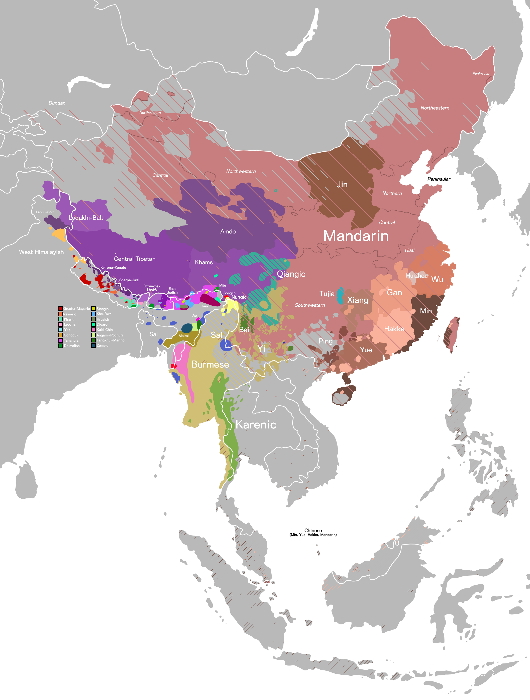
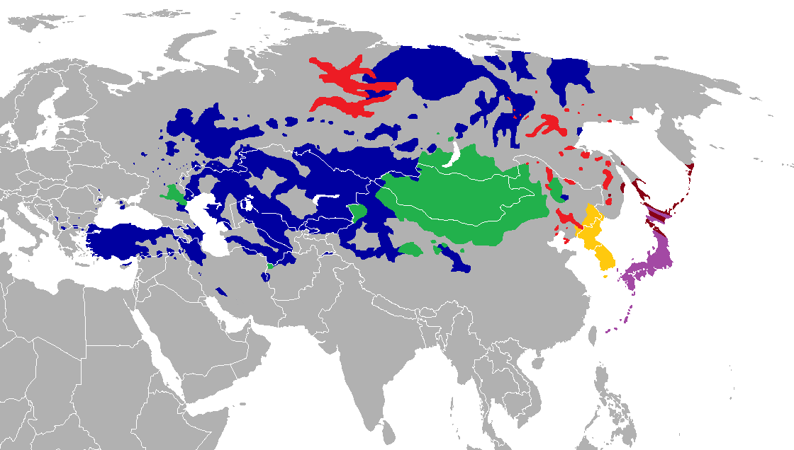
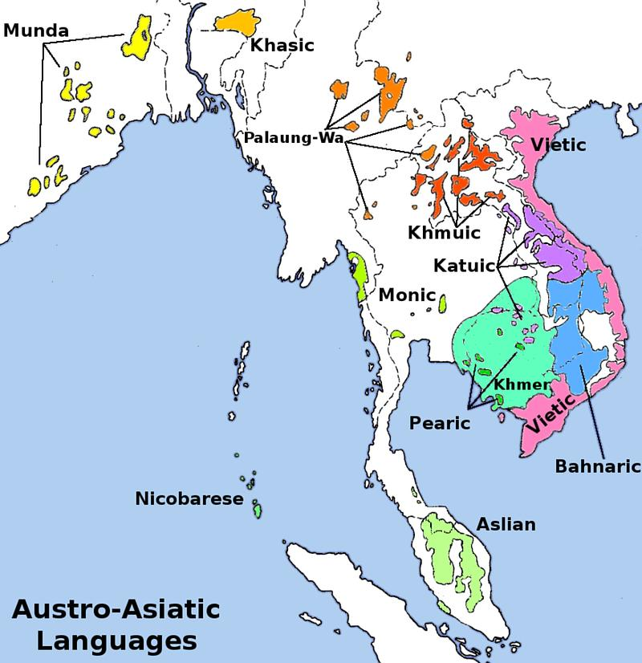
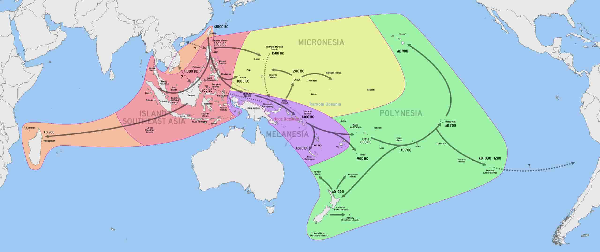
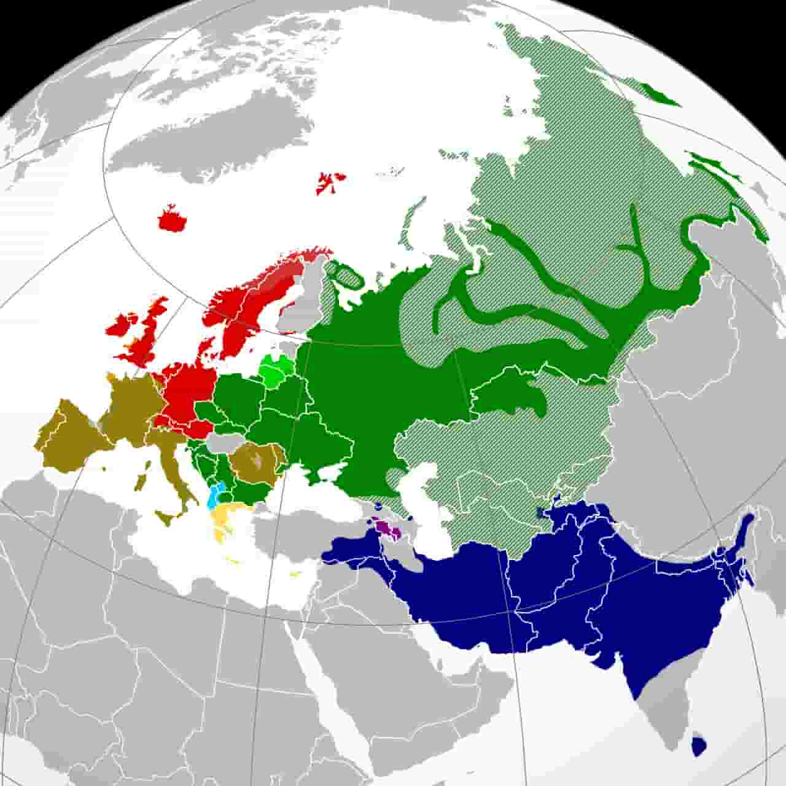

根据语言语系来归类五十六个民族

<!--truncate-->
 

## 汉藏语系

| 民族      | 语言 | 语种 |
| --- | --- | --- |
| 汉族      | 汉语       |        |
| 回族   |         |        |
| 藏族      |        |        |
| 苗族   |         |        |
| 彝族      | 彝语       | 汉藏语系 藏缅语族 彝语支       |
| 壮族      |        |        |
| 布依族   | 布依語        |        |
| 侗族      |        |        |
| 瑤族   |         |        |
| 白族      | 白语       |        |
| 土家族      | 土家语       |        |
| 哈尼族   |         |        |
| 傣族      |        |        |
| 黎族   |         |        |
| 傈僳族      |        |        |
| 畬族      |        |        |
| 拉怙族   |         |        |
| 水族      |        |        |
| 纳西族   |         |        |
| 景颇族      |        |        |
| 仡佬族 [gē lǎo zú]      | 仡佬语       | 汉藏语系 仡佬语族 [注: 百度百科]                                    |
| 羌族   |         |        |
| 毛南族      | 毛南语       | 汉藏语系 壮侗语族 侗水语支       |
| 仫佬族 [mù lǎo zú]   | 仫佬语        | 汉藏语系 壮侗语族 侗水语支       |
| 阿昌族      | 阿昌语       | 汉藏语系 藏缅语族 缅彝语支      |
| 普米族      | 普米语       | 汉藏语系 藏缅语族 羌语支       |
| 怒族   | 怒语 (分支差异大)        | 汉藏语系 藏缅语族       |
| 独龙族      | 独龙语       | 汉藏语系 藏缅语族 侬语支       |
| 门巴族   | 门巴语        | 汉藏语系 藏缅语族 北门巴语支       |
| 珞巴族      | 珞巴语       | 汉藏语系 藏缅语族 达尼语支(多方言)       |
| 基诺族   | 基诺语        | 汉藏语系 藏缅语族 彝语支       |

 
 

## 阿尔泰语系

| 民族      | 语言 | 语种 |
| --- | --- | --- |
| 蒙古族      | 蒙古语        | 阿尔泰语系 蒙古语族       |
| 维吾尔族   |         |        |
| 朝鲜族      | 朝鲜语       |        |
| 满族   |         |        |
| 哈萨克族      |        |        |
| 东乡族      |        |        |
| 达斡尔族   |         |        |
| 柯尔克孜族      |        |        |
| 土族   |         |        |
| 撒拉族      |        |        |
| 锡伯族      |        |        |
| 乌兹别克族   | 乌孜别克语        | 阿尔泰语系 突厥语族 葛逻禄语支       |
| 鄂温克族 (通古斯 或 索伦)      | 鄂温克语       | 阿尔泰语系 通古斯语族 鄂温克语支       |
| 保安族   | 保安语        | 阿尔泰语系 蒙古语族       |
| 裕固族      | 尧乎尔语 / 恩格尔语 | 阿尔泰语系 - 突厥语族的裕固语 (尧乎尔语) / 蒙古语族的裕固语 (恩格尔语)        |
| 塔塔尔族      | 塔塔尔语       | 阿尔泰语系 突厥语族 西匈语支       |
| 鄂伦春族   | 鄂伦春语        | 阿尔泰语系 满—通古斯语族 北满通古斯语支       |
| 赫哲族      | 赫哲语       | 阿尔泰语系 满-通古斯语族 赫哲语支       |

 
 

## 南亚语系

| 民族      | 语言 | 语种 |
| --- | --- | --- |
| 佤族      |        |        |
| 布朗族      |        |        |
| 德昂族      | 德昂语       | 南亚语系 孟-高棉语族 佤德昂语支       |
| 京族      | 京族语       | 南亚语系 孟-高棉语族 越芒语支 中国京语       |

 
 

## 南岛语系

| 民族      | 语言 | 语种 |
| --- | --- | --- |
| 台湾高山族      | 高山语      | 南岛语系 印度尼西亚语族       |

 
 

## 印欧语系

| 民族      | 语言 | 语种 |
| --- | --- | --- |
| 塔吉克族 - 高原塔吉克族(中国)     | 塔吉克语      | 印欧语系 伊朗语族 帕米尔语支       |
| 俄罗斯族      | 俄语      | 印欧语系 斯拉夫语族 东斯拉夫语支       |

 
 

## 参考链接
* [中華民族五十六個民族基本資料概要](https://www.travel104.com.tw/china/56pepo.htm#%E5%B0%8E%E8%A6%BD%E7%9B%AE%E9%8C%84)
* [维基百科-汉藏语系](https://zh.wikipedia.org/zh-hans/%E6%B1%89%E8%97%8F%E8%AF%AD%E7%B3%BB)
* [维基百科-阿尔泰语系](https://zh.wikipedia.org/zh-cn/%E9%98%BF%E5%B0%94%E6%B3%B0%E8%AF%AD%E7%B3%BB)
* [维基百科-南亚语系](https://zh.wikipedia.org/zh-hans/%E5%8D%97%E4%BA%9A%E8%AF%AD%E7%B3%BB)
* [维基百科-南岛语系](https://zh.wikipedia.org/wiki/%E5%8D%97%E5%B3%B6%E8%AA%9E%E7%B3%BB)
* [维基百科-印欧语系](https://zh.wikipedia.org/zh-hans/%E5%8D%B0%E6%AC%A7%E8%AF%AD%E7%B3%BB)

 
 
