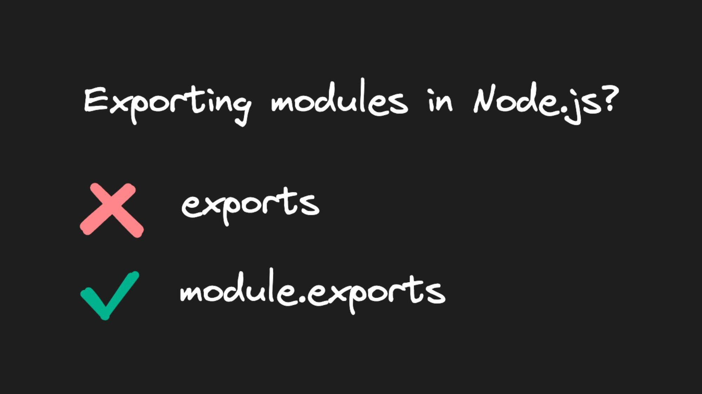

如果您使用过 Node.js, 您可能熟悉用于将代码从一个模块导出到 另一个模块的关键字 `module.exports` 和 `exports`

虽然乍一看它们似乎可以互换，但有充分的理由将其中一个用于替换另一个

## Import export patterns

## Object references in JavaScript

### `module.exports` VS `exports`

现在我们了解了对象在 JavaScript 中的工作方式, 让我们将它与 `module.exports` 和联系起来 `exports`

在 Node.js 中, `module` 是一个带有属性的普通 JavaScript 对象 `exports`

exports 是一个普通的 JavaScript 变量, 恰好被设置为 `module.exports`

当您需要另一个文件中的模块时, 该模块中的代码将被执行, 并且只 `module.exports` 返回

```js
var module = { exports: {} };

var exports = module.exports;

// Assigning exports to module.exports via object reference...

exports.add = add; // ...results in module.exports.add = add
exports.subtract = subtract; // ...results in module.exports.subtract = subtract

// The module.exports object contains both add and subtract properties

return module.exports;
```

但是, 如果您将新对象分配给 `exports`,引用将被破坏并且更新 `exports` 不再更新 `module.exports`

```js
var module = { exports: {} };

var exports = module.exports;

// Below assignment breaks the object reference

exports = {
  add: (a, b) => a + b,
  subtract: (a, b) => a - b,
};

return module.exports; // module.exports = {}

```

如果您尝试访问 `add` 或 `subtract` 访问导出的对象, 则会抛出错误, 因为 `module.exports` 它是空的

因此, 虽然 `module.exports` 和 `exports` 在第一个导入导出模式中看起来可以互换, 但它们并不相同

<br />

## 结论

什么时候应该选择 `exports` 而不是 `module.exports`?

简短的回答是: 你可能不应该这样做! 虽然 `exports` 可能更短并且看起来更方便，但它可能造成的混乱是不值得的

请记住, `exports` 只是对 `module.exports` 的引用，将新对象分配给 `exports` 会破坏该引用


<br />

## 参考链接

* [Node.js 中 module.exports vs exports 的区别](https://mp.weixin.qq.com/s/gveszANVoqy_6qecDH_kbw)
* [Node.js module.exports vs. exports: The Right Choice](https://www.builder.io/blog/nodejs-module-exports-vs-exports)
