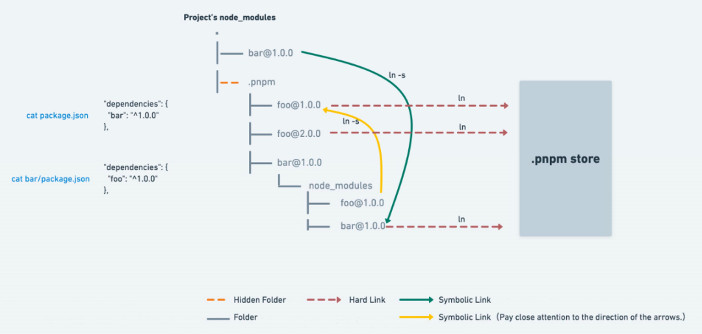

P就是performance, 字面意思就是 `高性能npm`, Pnpm 和 npm的命令基本相同, 但是在 安装文件结构上做了很大改进

要了解pnpm首先要知道 `软链接 (symbolic link)` 和 `硬链接 (hard link)`的基础知



`pnpm` 首先利用硬链接将所需的包从 `node_modules/.pnpm` 硬链接到 store 中, 然后通过 软链接 和 硬链接来组织目录结构

将 全局的依赖链接到 项目中, 将项目的 直接依赖链接到 node_modules 的顶层

所有的依赖则平铺于 `node_modules/.pnpm` 目录下, 实现了所有项目的依赖共享 store 的全局依赖，解决了 幽灵依赖 和 NPM 分身的问题

<br />

我们在安装的过程中也可以看到:


包是从 `全局 store` 硬链接到 `虚拟 store` 的, 这里的 虚拟 store 就是 `node_modules/.pnpm`


我们打开 `node_modules` 看一下

将包本身 和 依赖放在同一个 `node_module` 下面, 与 原生 Node 完全兼容, 又能将 package 与相关的依赖很好地组织到一起


确实不是扁平化的了，依赖了 express, 那 `node_modules` 下就只有 express, 没有幽灵依赖

<br />

**展开 `.pnpm` 看一下**

`.pnpm` 目录下呈现的是 扁平的目录结构, 但顺着 软链接慢慢展开, 其实依赖是 嵌套的结构


所有的依赖 都在这里铺平了，都是从 全局 store 硬连接 过来的，然后包 和 包之间的依赖关系是通过 软链接组织的

比如 `.pnpm` 下的 expresss, 这些都是软链接


也就是说，所有的依赖都是从全局 store 硬连接到了 `node_modules/.pnpm` 下，然后之间通过软链接来相互依赖


<br />

## Pnpm 优点
> Fast, disk space efficient package manager

1. 通过 软硬链接的方式速度快
2. 节省磁盘空间, 一个包只需要保存一份, 其余的都是 软链接 和 硬链接
3. 支持 `monorepo`

节省磁盘空间: 一个包全局只保存一份，剩下的都是软硬连接，这得节省多少磁盘空间

其次就是快, 因为通过 链接的方式而不是复制，自然会快


相比 `npm2` 的优点就是: 不会进行 同样依赖的多次复制
相比 `yarn` 和 `npm3+`: 没有幽灵依赖, 也不会 有没有被提升的依赖依然复制多份的问题
这就已经足够优秀了, 对 `yarn` 和 `npm` 可以说是降维打击


## 基本使用

```bash
# 在npm基础上全局安装
npm install pnpm -g

# 设置源
pnpm config get registry    # 查看源
# 切换淘宝源 (也可通过 nrm切换)
pnpm config set registry http://registry.npm.taobao.org

# 安装依赖
pnpm install 包
pnpm i 包
pnpm add 包                 # -S  默认写入dependencies
pnpm add -D                 # -D devDependencies
pnpm add -g                 # 全局安装

# 移除
pnpm remove 包              # 移除包
pnpm remove 包 --global     # 移除全局包

# 更新
pnpm up                     # 更新所有依赖项
pnpm upgrade 包             # 更新包
pnpm upgrade 包 --global    # 更新全局包

# 设置存储路径
pnpm config set store-dir /path/to/.pnpm-store
```

<br />

## 总结

综合来看, `pnpm` 是一个相比 npm/yarn 更优的方案,但还是会存在一些问题, 比如: 全局共用一个 `store`的情况下, 修改 `node_modules` 中的内容时, 会影响 全局store中的对应内容, 可能会对其它项目造成影响

对于将项目从 npm换为 `pnpm` 的过程中, 可能会遇到的问题, 官网也提供了一些[解决方案](https://pnpm.io/faq#pnpm-does-not-work-with-your-project-here)

### 参考链接

* [Pnpm探究 - 好未来技术](https://mp.weixin.qq.com/s/NZL9fj3XZS640eYumzcKZw)
* [pnpm的安装与使用](http://liqingsong.cc/article/detail/26)
* [pnpm 是凭什么对 npm 和 yarn 降维打击的](https://mp.weixin.qq.com/s/bLthdXlmu8wtC3ScAaZ3Kg)
