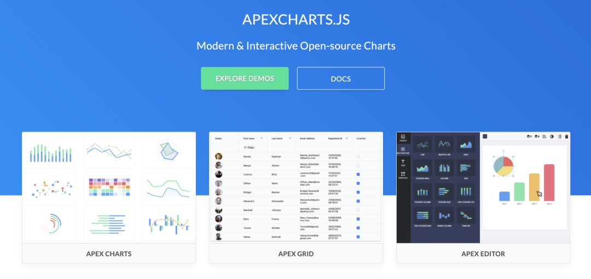
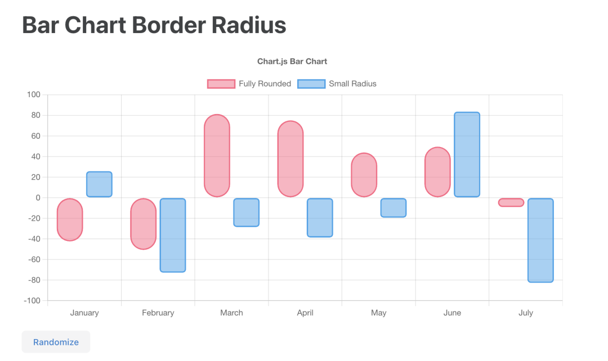
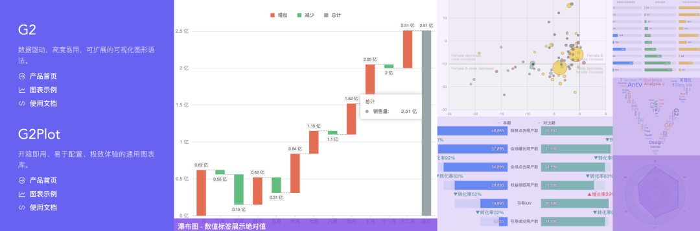
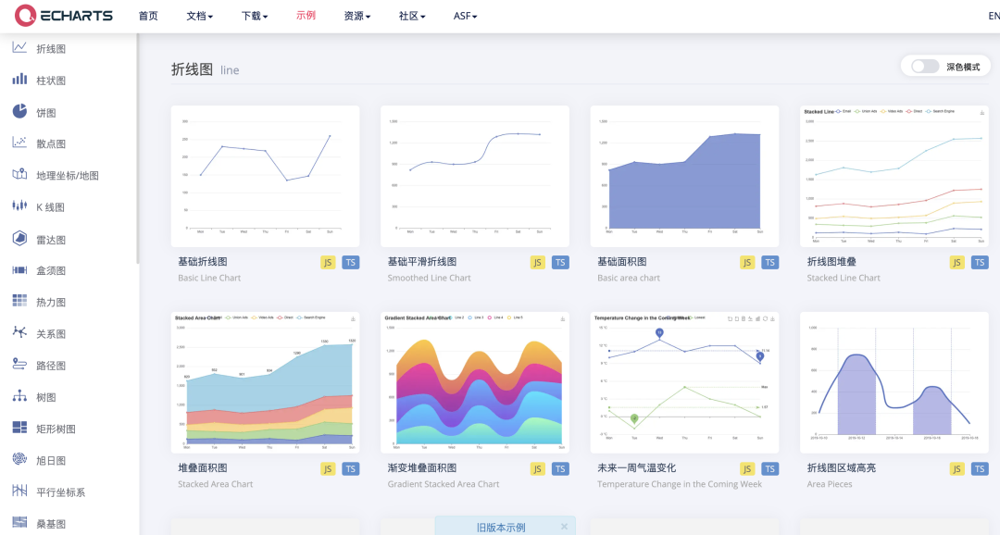
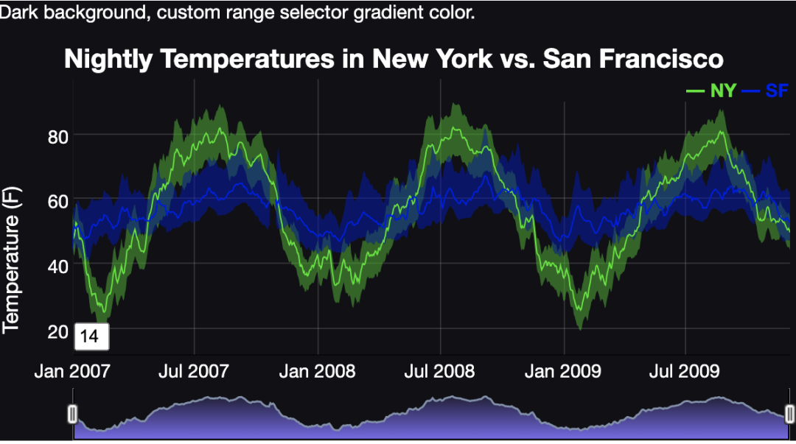
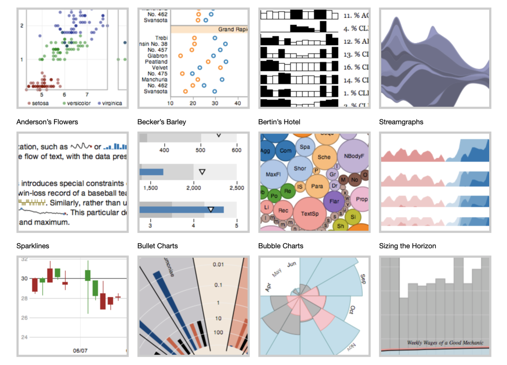
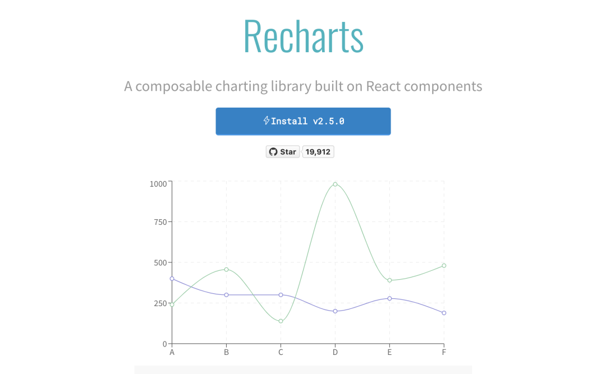
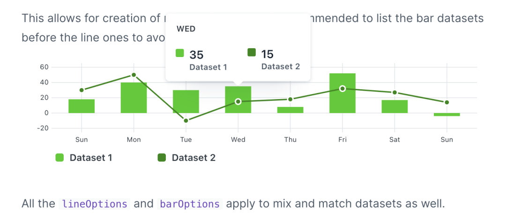
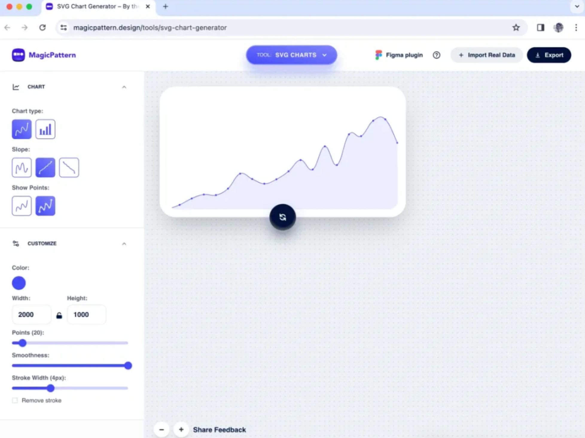
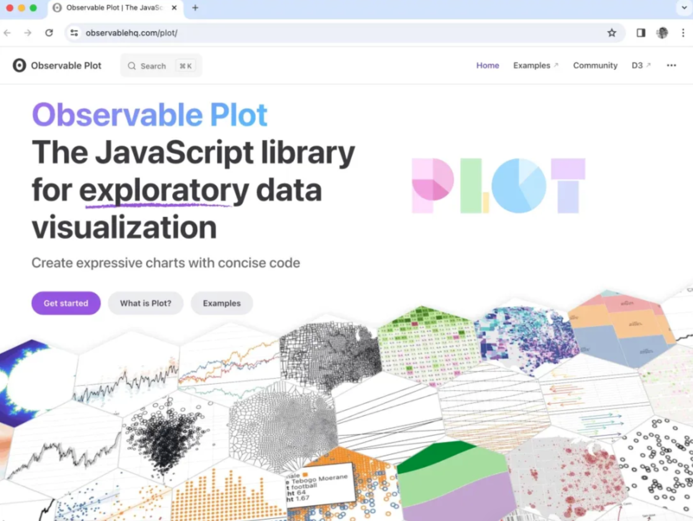

### D3.js

### ApexCharts

### Chart.js

### AntV

### Echarts

### Nivo

### dygraphs

### Protovis

### Recharts

Recharts 含义是重新定义 (Redefined)图表

这个名字的背后在于这个图表在设计上带给开发者的是不一样的体验，不仅是用 React 设计, 也在于重新定义了组合与配置方式

### frappe-charts

### SVG Chart Generator

SVG Chart Generator 是一款设计精美的图表生成器，可让我们生成基于 SVG 的折线或条形格式的图表

SVG 图表生成器允许我们交互式地自定义图表的宽高设置、平滑度等。我们还可以导入自己的数据点

### Observable Plot

Observable Plot 是一个 JS 库，使用 SVG 筑基的图表，创建探索性数据可视化

绘图界面可以包括特定功能，比如比例、投影、曲线等

## 参考链接

* [分享10+可视图表库, 助你轻松制作精美可视化大屏](https://mp.weixin.qq.com/s?__biz=MzU2Mzk1NzkwOA==&mid=2247496537&idx=1&sn=ff602aa7b2b25fff0a65c301bc06a2d1&chksm=fc50eaa2cb2763b4fb292df804d93ee3060f75ed48ddcd2aca0755a6a7d820dbb617552f7667&scene=178&cur_album_id=1972186128682221573#rd)
* [2023 顶级前端工具](https://mp.weixin.qq.com/s/8YRQNy65kVyOhw5tHvooJQ)
