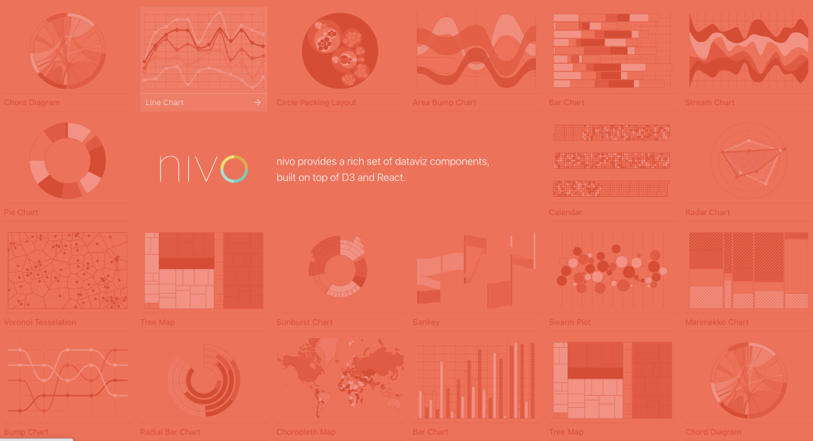

### D3.js

### ApexCharts

### Chart.js

### AntV

### Echarts

### Nivo

### dygraphs

### Protovis

### Recharts

Recharts 含义是重新定义 (Redefined)图表

这个名字的背后在于这个图表在设计上带给开发者的是不一样的体验，不仅是用 React 设计, 也在于重新定义了组合与配置方式

### frappe-charts

## 参考链接

* [分享10+可视图表库, 助你轻松制作精美可视化大屏](https://mp.weixin.qq.com/s?__biz=MzU2Mzk1NzkwOA==&mid=2247496537&idx=1&sn=ff602aa7b2b25fff0a65c301bc06a2d1&chksm=fc50eaa2cb2763b4fb292df804d93ee3060f75ed48ddcd2aca0755a6a7d820dbb617552f7667&scene=178&cur_album_id=1972186128682221573#rd)
