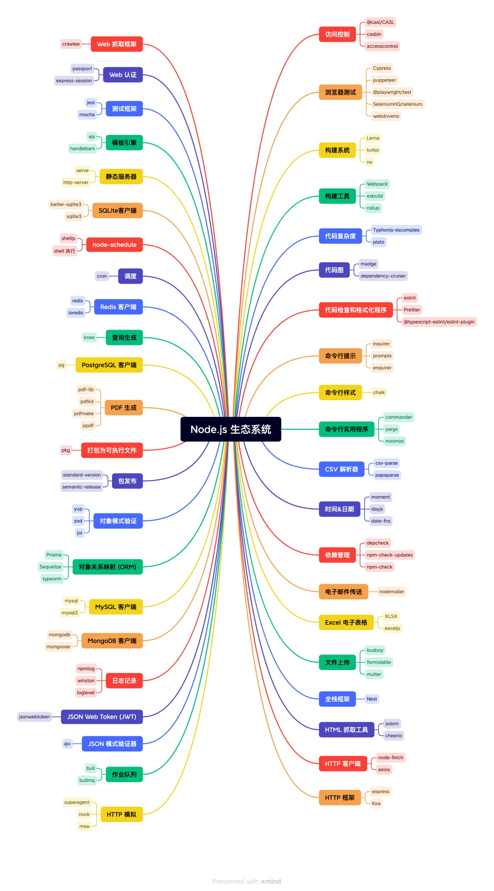

<br />
<br />

## Lodash
Lodash 是一个 JavaScript 实用程序库,它提供了一组用于处理数组、对象、字符串和其他数据类型的函数

Lodash 函数旨在针对性能进行高度优化,它们可以帮助提高 Node.js 应用程序的速度和效率

```js
const sum = require('lodash.sum')
const filter = require('lodash.filter')

const arr = [1, 2, 3, 4, 5];
const sumNumber = sum(arr);
console.log(sumNumber); // 15

const data = [1, 2, 3, 4, 5];
const filteredData = filter(data, num => num % 2 === 0);
console.log(filteredData); // Output: [2, 4]
```

<br />

## node-cache
node-cache 是一个缓存库,使开发人员能够在 Node.js 应用程序中缓存数据

缓存有助于减少数据库查询和 API 调用的次数,从而提高应用程序性能

```js
const NodeCache = require('node-cache');
const cache = new NodeCache({ stdTTL: 60 });
cache.set('key', 'value');
const value = cache.get('key');
console.log(value); // 'value'
```

<br />

## Day.js
Moment.js 的 2kB 轻量化方案,拥有同样强大的 API

Day.js 是一个轻量的处理时间和日期的 JavaScript 库,和 Moment.js 的 API 设计保持完全一样

```js
dayjs().format()
// 默认返回的是 ISO8601 格式字符串 '2020-04-02T08:02:17-05:00'

dayjs('2019-01-25').format('[YYYYescape] YYYY-MM-DDTHH:mm:ssZ[Z]')
// 'YYYYescape 2019-01-25T00:00:00-02:00Z'

dayjs('2019-01-25').format('DD/MM/YYYY') // '25/01/2019'
```

<br />

## Redis
Redis 是一种开源内存数据结构存储,可用作数据库、缓存和消息代理

Redis 可以通过实现快速数据检索和存储来帮助提高应用程序性能

```js
const redis = require('redis');
const client = redis.createClient();
client.set('key', 'value');
client.get('key', function (err, value) {
  console.log(value); // 'value'
});
```

## Nodemailer
Nodemailer 是 Node.js 应用程序的一个模块, 使开发人员能够发送电子邮件

Nodemailer 使从 Node.js 应用程序发送电子邮件变得更加容易和高效

```js
const nodemailer = require('nodemailer');
const transporter = nodemailer.createTransport({
  service: 'gmail',
  auth: {
    user: 'your-email@gmail.com',
    pass: 'your-password'
  }
});
const mailOptions = {
  from: 'your-email@gmail.com',
  to: 'recipient-email@gmail.com',
  subject: 'Test email',
  text: 'This is a test email'
};
transporter.sendMail(mailOptions, function (error, info) {
  if (error) {
    console.log(error);
  } else {
    console.log('Email sent: ' + info.response);
  }
});
```

## Sharp
Sharp 是用于 Node.js 应用程序的高性能图像处理库
Sharp 可用于实时调整大小、裁剪和操作图像,这有助于提高应用程序性能

```js
const sharp = require('sharp');
sharp('input.jpg')
  .resize(200, 200)
  .toFile('output.jpg', function (err) {
    if (err) {
      console.log(err);
    } else {
      console.log('Image resized and saved');
    }
  });
```

<br />

## Morgan
Morgan 是一个流行的 Node.js 应用程序日志记录中间件

Morgan 可用于记录 HTTP 请求和响应,这可以帮助开发人员调试和优化他们的应用程序

```js
const express = require('express');
const morgan = require('morgan');
const app = express();
app.use(morgan('combined'));
app.get('/', (req, res) => {
  res.send('Hello World!');
});
app.listen(3000, () => {
  console.log('Server started on port 3000');
});
```


## Node-gzip

Node-gzip 是一个用于在 Node.js 应用程序中压缩和解压缩数据的模块

压缩可以通过减少通过网络发送的数据大小来帮助提高应用程序性能

```js
const zlib = require('zlib');
const input = 'Lorem ipsum dolor sit amet';
zlib.gzip(input, function (err, compressed) {
  if (err) {
    console.log(err);
  } else {
    console.log('Compressed data: ' + compressed.toString('base64'));
    zlib.gunzip(compressed, function (err, decompressed) {
      if (err) {
        console.log(err);
      } else {
        console.log('Decompressed data: ' + decompressed.toString());
      }
    });
  }
});
```

## Bcrypt

Bcrypt 是 Node.js 应用程序中用于散列密码的流行模块

散列密码有助于提高应用程序安全性和保护用户数据

```js
const bcrypt = require('bcrypt');
const password = 'mypassword';
bcrypt.hash(password, 10, function (err, hash) {
  if (err) {
    console.log(err);
  } else {
    console.log('Hashed password: ' + hash);
    bcrypt.compare(password, hash, function (err, result) {
      if (err) {
        console.log(err);
      } else {
        console.log('Password match: ' + result);
      }
    });
  }
});
```

<br />

## fs-extra

fs-extra让Node.js文件操作文件更人性化, fs-extra提供以同步方式 新建,复制,移动,删除,修改,写入 文件和文件夹的方法


<br />

## Node.js Toolbox

当我们在做 Node.js 的一些技术选型时,会有一些这样的考虑 🤔️

例如: 日志模块都有哪些、全栈型的框架有哪些、ORM 都有哪些等等

**[Node.js Toolbox](https://nodejstoolbox.com/)**, 可以快速的帮我们查找在 Node.js 生态系统中有哪些积极维护且流行的库,并已经做好了分类

<br />

## Commander

在软件开发中, 命令行界面 (CLI)以其高效和直接的交互方式被广泛应用

为了让开发者更加轻松地创建强大且友好的CLI工具, Commander库应运而生

这个库以其直观的API和简洁的设计理念, 让命令行工具的开发变得前所未有的简单

<br />

## Async

在现代的JavaScript开发中, 异步编程是避不开的话题

无论是处理网络请求、读写文件操作还是其他非阻塞操作, 异步编程都扮演着关键的角色

Async库以其提供的一系列函数和控制流结构, 为管理和协调这些随时间进行的任务 (或者说 Promise)提供了强大的支持

它旨在通过清晰和可预测的方式, 解决异步编程的复杂性

#### Async的优点

* 清晰简洁的API: Async提供了直观的函数,用于处理常见的异步模式,使代码的可读性和可维护性得到了简化

* 控制流结构: 通过像async.waterfall和async.auto这样的构造,Async能够管理复杂的异步工作流

* 错误处理: Async促进了在异步操作中强大的错误传播和处理机制

<br />

## fs-extra

在Node.js开发中, 文件系统操作是一项基础而重要的任务

fs-extra库作为Node.js内建的fs模块的扩展,提供了丰富的附加功能和实用工具,极大地简化了文件系统操作

它让开发者能够更加轻松和灵活地管理文件和目录,节省时间和精力,同时确保了健壮的错误处理和跨平台兼容性

<br />

## date-fns

在Web和应用开发中, 日期和时间的处理是一个常见但又复杂的任务

date-fns库作为moment库的一个现代替代品, 以其提供的广泛函数集合专门用于操作、格式化和分析日期和时间, 凭借出色的灵活性和精确度而脱颖而出

它隐藏了原生Date对象的复杂性, 提供了一个流畅的API、不可变的数据结构, 并且聚焦于函数式编程原则, 以确保相关操作的可预测性和无误

<br />

## mkdirp

在Node.js项目开发过程中, 创建文件目录结构是一个常见的需求

mkdirp库以其能够轻松处理嵌套目录结构的能力, 成为了处理这一任务的首选工具

它确保每个路径都被正确创建, 即使是在复杂的目录层次中也能保持优雅和简洁

mkdirp的优点:

* 递归创建: 一次函数调用, 轻松构建整个目录层次结构

* 错误处理: 提供了强大的机制来管理目录创建过程中可能遇到的错误

* 异步支持: 与promises和异步操作完美结合, 有效融入非阻塞工作流

* 自定义选项: 允许开发者控制目录权限等属性, 增强了控制力

<br />

## glob

在Node.js项目开发中,  经常需要根据特定模式查找文件集合,  无论是构建应用、运行测试,  还是处理数据

glob库凭借其能够基于预定义模式追踪项目中的文件,  帮助开发者用简洁的表达式识别特定文件集,  简化了这些任务

glob的优点:

* 简洁且富有表现力: 模式提供了指定所需文件的直观方式

* 灵活的匹配: 支持通配符、否定和扩展, 实现细粒度控制

* 跨平台兼容性: 在不同操作系统中保持一致的行为

* 高效的文件查找: 最小化手动搜索文件所花费的时间

<br />

## RxJS

在JavaScript应用开发中,  处理异步数据流是一个普遍且复杂的挑战

RxJS (Reactive Extensions for JavaScript)以其对异步数据流的高效协调能力, 让你能够清晰地处理事件、优雅地处理错误, 并用清晰的方式组合复杂的流程, 将你的JavaScript应用转变为动态的数据处理器

RxJS的优点

* 异步操作的复杂性管理: 简化了事件、计时器、Promises及其他异步操作的处理

* 声明式和函数式风格: 促进了代码的简洁、可读性和可测试性

* 组合性和可重用性: 通过操作符可以从简单的数据流中优雅地构建复杂的数据流

* 错误处理: 提供了强大的机制来管理错误，避免意外失败

<br />

## 参考链接

* [10大 Node.js 库可以帮助你优化代码和简化开发](https://mp.weixin.qq.com/s/QENs40MwDo7rV0hyhlHzbg)
* [令人极度舒适的 Node.js 包和资源列表](https://zhuanlan.zhihu.com/p/385852664)
* [2023 年的 Node.js 生态系统](https://mp.weixin.qq.com/s/D2GAltuKVInCbyUutgAl3w)
* [2024年 Node.js 精选: 50款工具库集锦, 项目开发轻松上手（一）](https://mp.weixin.qq.com/s?__biz=MjM5MjU2NDk0Nw==&mid=2247515860&idx=1&sn=6ed1edda5563b0c1252f28cb6033c167&chksm=a6a6ad6891d1247e0b0afec7c082d06b4f1d4ffe3a8480b6dd25eb38557b8e9e807fe3b33a30)
* [2024年 Node.js 精选: 50款工具库集锦, 项目开发轻松上手（二）](https://mp.weixin.qq.com/s/GxrI6xFX81wCkoZ7W5F9_Q)
<br />
