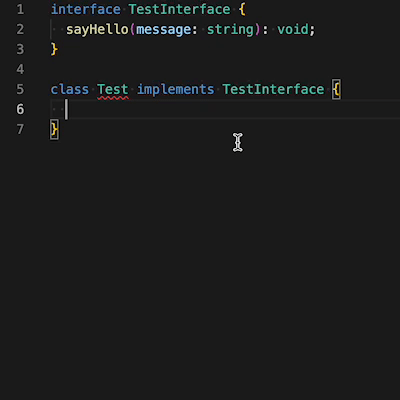

## Awaited 类型与 Promise 改进

新的 `Awaited<>`实用程序类型能从无限嵌套的 Promises 中提取值类型 (类似于 await 对该值的操作)

这也改进了 `Promise.all()` 的类型推断

```ts
// Let's say we want to have a generic awaited value.
// We can use the Awaited utility type for this (its source code was part of a previous example),
// so infinitely nested Promises all resolve to their value.
type P1 = Awaited<string>; // typed as string
type P2 = Awaited<Promise<string>>; // typed as string
type P3 = Awaited<Promise<Promise<string>>>; // typed as string
```

<br />

## 导入名称上的类型修饰符

在普通 (非 `import type`)导入语句中, 关键字 type 可用于表示该值只应在类型编译时导入 (且可以去除)

```ts
// PREVIOUSLY:
// The optimal way to import types is to use the `import type` keyword to prevent them from actually being imported after compilation.
import { something } from './file';
import type { SomeType } from './file';
// This needs two import statements for the same file.

// NEW:
// Now this can be combined into one statement.
import { something, type SomeType } from './file';
```

<br />

## const 断言

在将常量定义为 `as const` 时，即可将其准确归类为 字面量类型

这项功能有多种用例，可以轻松进行准确分类

此功能还会令对象和数组成为 `readonly`, 防止常量对象发生突变

```ts
// PREVIOUSLY:
// The optimal way to import types is to use the `import type` keyword to prevent them from actually being imported after compilation.
import { something } from './file';
import type { SomeType } from './file';
// This needs two import statements for the same file.

// NEW:
// Now this can be combined into one statement.
import { something, type SomeType } from './file';
```

<br />

## 类中各方法的片段补全

当一个类继承多个方法类型时, 编辑器现可为各类型提供建议片段


