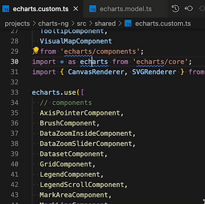
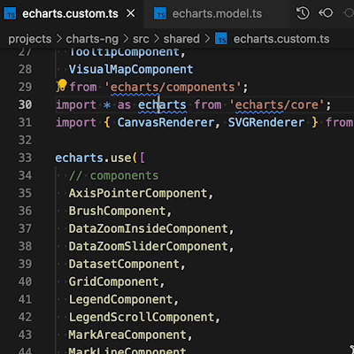

## 在 Node.js 中支持 ECMAScript 模块

在使用 ES Modules 替代 CommonJS 时, TypeScript 现可支持指定默认值

具体指定在 tsconfig.json 中实现

```bash
...
"compilerOptions": [
...
"module": "es2020"
]
...
```

##  package.json 中的类型

package.json 中的 type 字段可被设定为 `"module"`，以供 ES Modules 使用 node.js

在大多数情况下, 这种方式对 TypeScript 已经足够，不需要前面提到的编译器选项

```bash
...
"type": "module"
...
```

## 实例化表达式

实例化表达式允许在引用一个值时，指定类型参数

这样可以在不创建包装器的前提下，收窄泛型类型

```ts
class List<T> {
  private list: T[] = [];
  get(key: number): T {
    return this.list[key];
  }
  push(value: T): void {
    this.list.push(value);
  }
}

function makeList<T>(items: T[]): List<T> {
  const list = new List<T>();
  items.forEach(item => list.push(item));
  return list;
}

// Let's say we want to have a function that creates a list but only allows certain values.
// PREVIOUSLY:
// We need to manually define a wrapper function and pass the argument.
function makeStringList(text: string[]) {
  return makeList(text);
}

// NEW:
// Using instantiation expressions, this is much easier.
const makeNumberList = makeList<number>;
```

## 扩展对推断类型变量的约束

在条件类型中推断类型变量时, 现在可以使用 extends 直接将其收窄 / 约束

```ts
// Let's say we want to type a type that only gets the first element of an array if it's a string.
// We can use conditional types for this.
// PREVIOUSLY:
type FirstIfStringOld<T> =
T extends [infer S, ...unknown[]]
? S extends string ? S : never
: never;
// But this needs two nested conditional types. We can also do it in one.
type FirstIfString<T> =
T extends [string, ...unknown[]]
// Grab the first type out of `T`
? T[0]
: never;
// This is still suboptimal because we need to index the array for the correct type.
// NEW:
// Using extends Constraints on infer Type Variables, this can be declared a lot easier.
type FirstIfStringNew<T> =
T extends [infer S extends string, ...unknown[]]
? S
: never;
// Note that the typing worked the same before, this is just a cleaner syntax.
type A = FirstIfStringNew<[string, number, number]>; // typed as string
type B = FirstIfStringNew<["hello", number, number]>; // typed as "hello"
type C = FirstIfStringNew<["hello" | "world", boolean]>; // typed as "hello" | "world"
type D = FirstIfStringNew<[boolean, number, string]>; // typed as never
```

## 类型参数的可选变体注释

泛型 在检查是否 “匹配” 时可以有不同行为，例如对 `getter` 和 `setter`, 对是否允许继承的判断是相反的

为了明确起见，现在用户可以明确指定

```ts
// Let's say we have an interface / a class that extends another one.
interface Animal {
  animalStuff: any;
}
interface Dog extends Animal {
  dogStuff: any;
}

// And we have some generic "getter" and "setter".
type Getter<T> = () => T;
type Setter<T> = (value: T) => void;

// If we want to find out if Getter<T1> matches Getter<T2> or Setter<T1> matches Setter<T2>, this depends on the covariance.
function useAnimalGetter(getter: Getter<Animal>) {
  getter();
}

// Now we can pass a Getter into the function.
useAnimalGetter((() => ({ animalStuff: 0 }) as Animal));

// This obviously works.
// But what if we want to use a Getter which returns a Dog instead?
useAnimalGetter((() => ({ animalStuff: 0, dogStuff: 0 }) as Dog));

// This works as well because a Dog is also an Animal.
function useDogGetter(getter: Getter<Dog>) {
  getter();
}

// If we try the same for the useDogGetter function we will not get the same behavior.
useDogGetter((() => ({ animalStuff: 0 }) as Animal)); // Type error: Property 'dogStuff' is missing in type 'Animal' but required in type 'Dog'.

// This does not work, because a Dog is expected, not just an Animal.
useDogGetter((() => ({ animalStuff: 0, dogStuff: 0 }) as Dog));

// This, however, works.
// Intuitively we would maybe expect the Setters to behave the same, but they don't.
function setAnimalSetter(setter: Setter<Animal>, value: Animal) {
  setter(value);
}

// If we pass a Setter of the same type it still works.
setAnimalSetter((value: Animal) => {}, { animalStuff: 0 });
function setDogSetter(setter: Setter<Dog>, value: Dog) {
  setter(value);
}

// Same here.
setDogSetter((value: Dog) => {}, { animalStuff: 0, dogStuff: 0 });

// But if we pass a Dog Setter into the setAnimalSetter function, the behavior is reversed from the Getters.
setAnimalSetter((value: Dog) => {}, { animalStuff: 0, dogStuff: 0 }); // Type error: Argument of type '(value: Dog) => void' is not assignable to parameter of type 'Setter<Animal>'.

// This time it works the other way around.
setDogSetter((value: Animal) => {}, { animalStuff: 0, dogStuff: 0 });

// NEW:
// To signal this to TypeScript (not needed but helpful for readability), use the new Optional Variance Annotations for Type Parameters.
type GetterNew<out T> = () => T;
type SetterNew<in T> = (value: T) => void;
```

## 使用 moduleSuffixes 实现分辨率自定义

在使用具有自定义文件后缀的环境时 (例如: `.ios` 用于原生应用构建), 现在您可以为 TypeScript 指定这些后缀以正确对导入进行解析

具体指定在 `tsconfig.json` 中实现

```ts
...
"compilerOptions": [
...
"module": [".ios", ".native", ""]
]
...
import * as foo from './foo';
// This first checks ./foo.ios.ts, ./foo.native.ts, and finally ./foo.ts.
```

## 在编辑器内转到源定义

在编辑器中，开放新的“转到源定义”菜单项

其功能类似于 "转到定义"，但更多指向 `.ts` 和 `.js` 文件，而非类型定义 (`.d.ts`)





