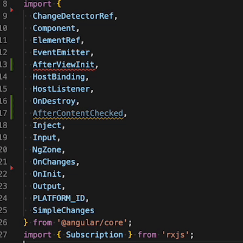

## satisfies 运算符

satisfies 运算符允许检查与类型间的兼容性, 且无需实际分配该类型

这样可以在保持兼容性的同时, 获得更准确的类型推断

```ts
// PREVIOUSLY:
// Let's say we have an object/map/dictionary which stores various items and their colors.
const obj = {
fireTruck: [255, 0, 0],
bush: '#00ff00',
ocean: [0, 0, 255]
} // typed as { fireTruck: number[]; bush: string; ocean: number[]; }
// This implicitly types the properties so we can operate on the arrays and the string.
const rgb1 = obj.fireTruck[0]; // typed as number
const hex = obj.bush; // typed as string
// Let's say we only want to allow certain objects.
// We could use a Record type.
const oldObj: Record<string, [number, number, number] | string> = {
fireTruck: [255, 0, 0],
bush: '#00ff00',
ocean: [0, 0, 255]
} // typed as Record<string, [number, number, number] | string>
// But now we lose the typings of the properties.
const oldRgb1 = oldObj.fireTruck[0]; // typed as string | number
const oldHex = oldObj.bush; // typed as string | number
// NEW:
// With the satisfies keyword we can check compatibility with a type without actually assigning it.
const newObj = {
fireTruck: [255, 0, 0],
bush: '#00ff00',
ocean: [0, 0, 255]
} satisfies Record<string, [number, number, number] | string> // typed as { fireTruck: [number, number, number]; bush: string; ocean: [number, number, number]; }
// And we still have the typings of the properties, the array even got more accurate by becoming a tuple.
const newRgb1 = newObj.fireTruck[0]; // typed as number
const newRgb4 = newObj.fireTruck[3]; // Type error: Tuple type '[number, number, number]' of length '3' has no element at index '3'.
const newHex = newObj.bush; // typed as string
```

## 编辑器中的“删除未使用的导入”与“排序导入”命令

在编辑器中，新命令 (及自动修复) “删除未使用的导入” 和 “排序导入” 让导入管理更加轻松易行




## 参考链接

* [三年回顾: JavaScript与TypeScript最新特性汇总](https://mp.weixin.qq.com/s/fvquxkZ3FoF1N3tG2ae2yw)

* [All JavaScript and TypeScript Features of the last 3 years](https://medium.com/@LinusSchlumberger/all-javascript-and-typescript-features-of-the-last-3-years-629c57e73e42)
